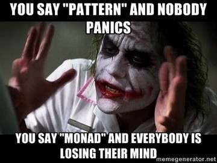

Wir haben in verschiedenen Kontexten immer wieder die gleichen Funktionen kennengelernt.
In diesem Kapitel wollen wir uns ein wenig den Hintergrund hinter diesen Funktionen anschauen.
Die Konzepte, die wir in diesem Kapitel lernen, sind vergleichbar mit _Pattern_ in objektorientierten Sprachen.
Das heißt, man identifiziert Funktionen, die man für verschiedene Datenstrukturen definieren kann und beschreibt, welche Eigenschaften diese Funktionen haben sollten.

{: .centered}


Funktoren
---------

Wir haben die Funktion `map` kennengelernt, die auf vielen verschiedenen Datentypen definiert werden kann.
Wir haben zum Beispiel die folgenden Funktionen kennengelernt.

``` elm
map : (a -> b) -> List      a -> List      b
map : (a -> b) -> Decoder   a -> Decoder   b
map : (a -> b) -> Generator a -> Generator b
```

Diese Signaturen unterschieden sich nur in dem Typkonstruktor, für den sie definiert sind.
Das heißt, es gibt eine Definition von `map` für den Typkonstruktor `List`, eine Definition für den Typkonstruktor `Decoder` und eine Definition für den Typkonstruktor `Generator`.
Das heißt, die Funktion `map` hat immer die Form

```elm
map : (a -> b) -> f a -> f b
```

wobei `f` ein Typkonstruktor ist.
Man bezeichnet einen Typkonstruktor `f`, für den es eine Funktion `map` gibt, als **Funktor**.
Es gibt noch viele weitere Typkonstruktoren, für die wir eine Funktion `map` definieren können.
Neben den Implementierungen von `map`, die wir kennengelernt haben, gibt es in den Standardbibliotheken von Elm zum Beispiel noch die folgenden Funktionen.

``` elm
map : (a -> b) -> Html     a -> Html     b
map : (a -> b) -> Cmd      a -> Cmd      b
map : (a -> b) -> Sub      a -> Sub      b
map : (a -> b) -> Result x a -> Result x b
```

Zur Illustration wollen wir eine weitere Variante der Funktion `map` definieren, dieses Mal für den Typkonstruktor `Maybe`.

``` elm
map : (a -> b) -> Maybe a -> Maybe b
map func maybeValue =
    case maybeValue of
        Nothing ->
            Nothing

        Just value ->
            Just (func value)
```

Leider können wir auch eine Funktion vom Typ `(a -> b) -> Maybe a -> Maybe b` definieren, die keine "sinnvolle" Implementierung darstellt.

``` elm
mapWeird : (a -> b) -> Maybe a -> Maybe b
mapWeird _ _ =
    Nothing
```

Um solche Implementierungen zu vermeiden, sollte die Implementierung der Funktion `map` für jeden Typkonstruktor bestimmte Gesetze erfüllen.
Das heißt, die Funktion muss den angegebenen Typ haben und sich auf gewisse Weise verhalten.
Die Funktion `map` sollte für alle möglichen Werte für `fx`, `f` und `g` die folgenden beiden Gesetze erfüllen.

| `map (\x -> x) fx       = fx`               |
| `map (\x -> f (g x)) fx = map f (map g fx)` |

Die Funktion `mapWeird` erfüllt zum Beispiel das erste Gesetz nicht, da für `fx = Just 42` die erste Gleichung nicht erfüllt ist, wie die folgenden Umformungen illustrieren.

``` elm
mapWeird (\x -> x) fx
=
mapWeird (\x -> x) (Just 42)
=
Nothing
/=
Just 42
=
fx
```

Applikative Funktoren
---------------------

Wir haben die folgende Funktion kennengelernt, um aus "einfachen" Decodern einen komplexeren zusammenzubauen.

``` elm
apply : Decoder a -> Decoder (a -> b) -> Decoder b
apply =
    Decode.map2 (|>)
```

Auch die Funktion `apply`[^1] kann für verschiedene Typkonstruktoren definiert werden.
So können wir in Elm zum Beispiel die folgenden Funktionen definieren.

``` elm
apply : List      a -> List      (a -> b) -> List      b
apply : Decoder   a -> Decoder   (a -> b) -> Decoder   b
apply : Generator a -> Generator (a -> b) -> Generator b
```

Während ein Funktor die Funktion `map` zur Verfügung stellt, stellt ein **applikativer Funktor** die Funktion `apply` zur Verfügung.
Damit ein Typkonstruktor `f` ein applikativer Funktor ist, muss es also eine Funktion

```elm
apply : f a -> f (a -> b) -> f b
```

geben.
Damit `f` ein applikativer Funktor ist, muss es neben der Funktion `apply` noch eine Funktion `pure : a -> f a` geben.
Es gibt eine solche Funktion für alle drei Typkonstruktoren, sie heißt nur immer anders.
Im Fall von `List` heißt die Funktion `pure` zum Beispiel `singleton`, im Fall von `Decoder` heißt sie `succeed`.

Um zu illustrieren, wofür die Funktionen `pure` und `apply` genutzt werden,  wollen wir die beiden Funktionen für den Typkonstruktor `Maybe` definieren.

``` elm
apply : Maybe a -> Maybe (a -> b) -> Maybe b
apply maybeValue maybeFunc =
    case maybeValue of
        Nothing ->
            Nothing

        Just value ->
            case maybeFunc of
                    Nothing
                Nothing ->

                Just func ->
                    Just (func value)
```

Wir definieren außerdem die Funktion `pure : a -> f a` für `Maybe`.

``` elm
pure : a -> Maybe a
pure =
    Just
```

Im Gegensatz zu `map` können wir mit `apply` zwei Strukturen kombinieren.
Im Fall des Typkonstruktors `Decoder` haben wir zum Beispiel gesehen, dass wir mithilfe der Funktion `apply` aus zwei einfachen Decodern einen komplexeren Decoder bauen können.
Im Fall von `Maybe` können wir `apply` auch nutzen, um zwei Werte zu kombinieren.
Wir betrachten das folgende Beispiel.
Wir wollen vom Benutzer zwei Zahlen einlesen und diese addieren.
Wir nutzen zum Einlesen der Zahlen die Funktion `String.toInt : String -> Maybe Int`.
Da das Parsen von beiden Eingaben möglicherweise fehlschlagen kann, müssen wir zwei Werte vom Typ `Maybe Int` kombinieren.
Dazu können wir die Funktion `apply` nutzen.

``` elm
add : String -> String -> Maybe Int
add userInput1 userInput2 =
    pure (+)
        |> apply (String.toInt userInput1)
        |> apply (String.toInt userInput2)
```

Die Implementierung von `add` liefert `Nothing` zurück, sobald einer der Aufrufe von `String.toInt` als Ergebnis `Nothing` liefert.
Nur falls beide Aufrufe ein Eregbnis der Form `Just value` liefern, wird die Funktion `+` auf diese beiden Ergebnisse angewendet und das Ergebnis der Addition anschließend wieder in den Konstruktor `Just` eingepackt.

Damit ein Typkonstruktor ein applikativer Funktor ist, müssen die Funktionen `pure` und `apply` ebenfalls Gesetze erfüllen.
Auf diese Gesetze wollen wir hier aber nicht eingehen[^2].
Es sei an dieser Stelle aber noch kurz erwähnt, dass jeder applikative Funktor auch ein Funktor ist.
Wir können die Funktion `map` nämlich mithilfe von `pure` und `apply` wie folgt definieren.

``` elm
map : (a -> b) -> Maybe a -> Maybe b
map func maybe =
    apply maybe (pure func)
```

Die Standardbibliotheken von Elm bieten für Datenstrukturen wie `List` und `Maybe` nicht die Funktion `apply` an, sondern nutzen die folgende Funktion.

```elm
map2 : (a -> b -> c) -> f a -> f b -> f c
```

Diese Funktion ist für Einsteiger vermutlich besser zugänglich.
Elm bietet zum Beispiel die Funktion

```elm
map2 : (a -> b -> c) -> List a -> List b -> List c
```

im Modul `List`, die Funktion

```elm
map2 : (a -> b -> c) -> Maybe a -> Maybe b -> Maybe c
```

im Modul `Maybe` und

```elm
map2 : (a -> b -> c) -> Decoder a -> Decoder b -> Decoder c
```

im Modul `Json.Decode`.
Wie haben die Funktion `apply` für `Decoder` mithilfe von `map2` definiert.
Falls eine Datenstruktur eine Funktion `map2 : (a -> b -> c) -> f a -> f b -> f c` zur Verfügung stellt, können wir `apply` mittels `map2 (|>)` definieren.

Falls eine Struktur eine Funktion `pure` zur Verfügung stellt, können wir mithilfe von `pure` und `apply` auch die Funktion `map2` definieren.

```elm
map2 (a -> b -> c) -> Maybe a -> Maybe b -> Maybe c
map2 func ma mb =
    apply (apply (pure func) ma) mb
```

Das heißt, statt --- wie in Haskell üblich --- die Funktionen `pure` und `apply` für einen applikativen Funktor zu definieren, könnten wir auch die Funktion `pure` und `map2` definieren.
Diesen Ansatz wählt die Programmiersprache Elm, um Einsteigern den Zugang zu vereinfachen.


Monaden
-------

In der funktionalen Programmierung gibt es eine ganze Reihe von Abstraktionen wie Funktor und applikativer Funktor.
Wir wollen uns an dieser Stelle noch eine dieser Abstraktionen anschauen, die **Monade** heißt und vergleichsweise legendär auch außerhalb der funktionalen Programmierung ist.

{: .centered}

Es gibt einige Funktionen, die sich mithilfe eines applikativen Funktors nicht ausdrücken lassen.
Wir betrachten dazu die folgende `apply`-Funktion.

```elm
apply : Decoder a -> Decoder (a -> b) -> Decoder b
```

Für unser Beispiel gehen wir davon aus, dass die JSON-Struktur, die wir verarbeiten wollen ein Feld mit der Version der Schnittstelle hat.
Abhängig von der Version wollen wir jetzt den einen oder anderen `Decoder` verwenden.
Wir definieren dazu erst einmal einen `Decoder`, der die Version liefert.

``` elm
versionDecoder : Decoder Int
versionDecoder =
    Decode.field "version" Decode.int
```

Außerdem haben wir die folgenden beiden `Decoder` für die beiden Varianten der JSON-Struktur.
Das heißt, in einer Version hieß das Feld `bool` und in einer anderen Version hieß es `boolean`.

``` elm
boolDecoder : Decoder Bool
boolDecoder =
    Decode.field "bool" Decode.bool

booleanDecoder : Decoder Bool
booleanDecoder =
    Decode.field "boolean" Decode.bool
```

Wir möchten jetzt gern einen `Decoder` definieren, der abhängig von der Version entweder `boolDecoder` oder `booleanDecoder` verwendet.
Diese Art von `Decoder` können wir mithilfe von `apply` aber nicht definieren.
Das Problem besteht darin, dass wir abhängig von einem Wert den `Decoder` bestimmen möchten.
Das Argument `Decoder (a -> b)` erlaubt es aber nicht, den `Decoder` danach zu wählen, welchen Wert wir als `a` übergeben bekommen.

Wir können die gewünschte Funktionalität aber mit der folgenden Funktion implementieren.

``` elm
andThen : (a -> Decoder b) -> Decoder a -> Decoder b
```

Hier haben wir statt eines Arguments `Decoder (a -> b)` jetzt ein Argument vom Typ `a -> Decoder b`.
Das heißt, wir können abhängig vom konkreten Wert, der vom Typ `a` übergeben wird, den `Decoder` wählen, den wir anschließend verwenden.
Wir können damit den folgenden `Decoder` definieren.
Wir verwenden hier die Funktion `|>` um die Argumente von `andThen` zu tauschen, ähnlich wie wir es bei der Verwendung von `apply` gemacht haben.

``` elm
decoder : Decoder Bool
decoder =
    let
        chooseVersion version =
            case version of
                1 ->
                    boolDecoder

                2 ->
                    booleanDecoder

                _ ->
                    Decode.fail ("Version " ++ String.fromInt version ++ " not supported")
    in
    versionDecoder
        |> Decode.andThen chooseVersion
```

Die Funktion `Decode.fail` liefert einen `Decoder`, der immer fehlschlägt.
Das heißt, wenn wir eine Version parsen und es sich weder um Version `1` noch um Version `2` handelt, liefert `decoder` einen Fehler.
Dieses Beispiel illustriert, dass wir mithilfe von `andThen` abhängig von einem Wert, den wir zuvor geparset haben, verschiedene `Decoder` ausführen können.

Wir wollen uns noch ein weiteres Beispiel für die Verwendung von `andThen` anschauen.
Dazu betrachten wir die Funktion `andThen : Maybe a -> (a -> Maybe b) -> Maybe b`.
Außerdem betrachten wir die folgenden beiden Funktionen, die wir im Kapitel [Polymorphismus](polymorphism.md) definiert haben.

``` elm
parseMonth : String -> Maybe Int
parseMonth userInput =
    case String.toInt userInput of
        Just number ->
            toValidMonth number

        Nothing ->
            Nothing


toValidMonth : Int -> Maybe Int
toValidMonth month =
    if 1 <= month && month <= 12 then
        Just month

    else
        Nothing
```

Wir können die Funktion `parseMonth` mithilfe von `andThen` wie folgt definieren.

``` elm
parseMonth : String -> Maybe Int
parseMonth userInput =
    String.toInt userInput |> Maybe.andThen toValidMonth
```

Neben der Funktion `andThen` muss ein Typkonstruktor `f`, der eine Monade ist, noch eine Funktion `return : a -> f a` zur Verfügung stellen.
Im Fall von `Decoder` ist `return` wie folgt definiert.

``` elm
return : a -> Decoder a
return =
    Decode.succeed
```

Wie beim Funktor und beim applikativen Funktor müssen die Funktionen einer Monade auch Gesetze erfüllen.
Die Funktionen `andThen` und `return` sollten für alle möglichen Werte für `x`, `fx`, `f` und `g` die folgenden drei Gesetze erfüllen.

| `andThen f (return x) = f x`                                    |
| `andThen return fx = fx`                                        |
| `andThen (\x -> andThen f (g x)) fx = andThen f (andThen g fx)` |

Wenn ein Typkonstruktor eine Monade ist, dann ist er auch ein applikativer Funktor.
Wir können nämlich wie folgt die Funktionen eines applikativen Funktors definieren, indem wir die Funktionen der Monade verwenden.

``` elm
pure : a -> Decoder a
pure =
    return


apply : Decoder a -> Decoder (a -> b) -> Decoder b
apply dx df =
    Decode.andThen (\x -> Decode.andThen (\f -> return (f x)) df) dx
```

Die [Typeclassopedia](https://wiki.haskell.org/Typeclassopedia) bietet noch weitere Informationen zu Abstraktionen in der funktionalen Programmierung.

<!-- Um komplexere `Decoder` zu definieren benötigen wir noch eine weitere Definition.
Diese Definition wollen wir bereits auch dieser Stelle einführen, auch wenn sie erst später benötigt wird.
Die Funktion `succeed : a -> Decoder a` liefert einen `Decoder`, der für alle JSON-Strukturen immer den Wert vom Typ `a` als Ergebnis liefert.
Das heißt, der Aufruf

```elm
decodeString (Decode.succeed 42) "true"
```

liefert genau so `Ok 42` als Ergebnis, wie der Aufruf

```elm
decodeString (Decode.succeed 42) "[1,2,3]"
```

Der Aufruf  -->

[^1]: In Elm wird die Funktion `apply` manchmal auch `andMap` genannt.

[^2]: Mehr Informationen zu applikativen Funktoren finden Sie in der wissenschaftlichen Publikation ["Applicative programming with effects"](<https://openaccess.city.ac.uk/id/eprint/13222/1/>) oder im [Wiki-Artikel](<https://wiki.haskell.org/Typeclassopedia#Applicative>) zur entsprechenden Struktur in Haskell.

<div class="nav">
    <ul class="nav-row">
        <li class="nav-item nav-left"><a href="folds.html">zurück</a></li>
        <li class="nav-item nav-center"><a href="index.html">Inhaltsverzeichnis</a></li>
        <li class="nav-item nav-right"><a href="final-topics.html">weiter</a></li>
    </ul>
</div>
