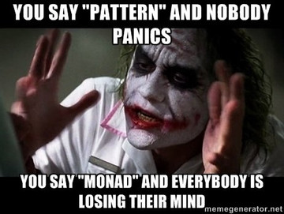
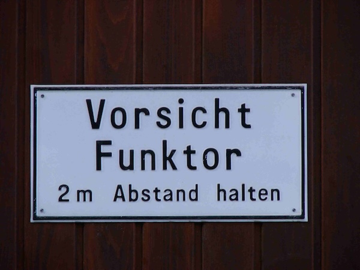

Wir haben in verschiedenen Kontexten immer wieder die gleichen Funktionen kennengelernt.
In diesem Kapitel wollen wir uns ein wenig den Hintergrund hinter diesen Funktionen anschauen.
Die Konzepte, die wir in diesem Kapitel lernen, sind vergleichbar mit _Pattern_ in objektorientierten Sprachen.
Bei _Pattern_ in objektorientierten Sprachen identifiziert man wiederkehrende Muster, die man zur Lösung von Problemen nutzen kann.
Bei den Abstraktionen in der funktionalen Programmierung identifiziert man Funktionen, die man für verschiedene Datenstrukturen definieren kann und die sich ähnlich verhalten.
Um die Ähnlichkeit zu beschreiben gibt man Eigenschaften an, welche diese Funktionen erfüllen sollten, unabhängig davon, für welche Datenstruktur die Funktion definiert ist.

{: .centered}

## Funktoren

Wir haben die Funktion `map` kennengelernt, die auf vielen verschiedenen Datentypen definiert werden kann.
Wir haben zum Beispiel die folgenden Funktionen kennengelernt.

```elm
map : (a -> b) -> List    a -> List    b
map : (a -> b) -> Html    a -> Html    b
map : (a -> b) -> Decoder a -> Decoder b
```

Diese Signaturen unterscheiden sich nur in dem Typkonstruktor, für den sie definiert sind.
Das heißt, es gibt eine Definition von `map` für den Typkonstruktor `List`, eine Definition für den Typkonstruktor `Html` und eine Definition für den Typkonstruktor `Decoder`.
Das heißt, die Funktion `map` hat immer die Form

```elm
map : (a -> b) -> f a -> f b
```

wobei `f` ein Typkonstruktor ist.



Es gibt noch viele weitere Typkonstruktoren, für die wir eine Funktion `map` definieren können.
Neben den Implementierungen von `map`, die wir kennengelernt haben, gibt es in den Standardbibliotheken von Elm zum Beispiel noch die folgenden Funktionen.

```elm
map : (a -> b) -> Cmd      a -> Cmd      b
map : (a -> b) -> Sub      a -> Sub      b
map : (a -> b) -> Result x a -> Result x b
```

Zur Illustration wollen wir eine weitere Variante der Funktion `map` definieren, dieses Mal für den Typkonstruktor `Maybe`.

```elm
map : (a -> b) -> Maybe a -> Maybe b
map func maybeValue =
    case maybeValue of
        Nothing ->
            Nothing

        Just value ->
            Just (func value)
```

Die obige Implementierung der Funktion `map` für `Maybe` ist aber nicht die einzige mögliche Implementierung.
Wir können zum Beispiel die folgende Funktion vom Typ `(a -> b) -> Maybe a -> Maybe b` definieren, die keine "sinnvolle" Implementierung darstellt.

```elm
mapWeird : (a -> b) -> Maybe a -> Maybe b
mapWeird _ _ =
    Nothing
```

Um solche Implementierungen zu vermeiden, sollte die Implementierung der Funktion `map` für jeden Typkonstruktor bestimmte Gesetze erfüllen.
Das heißt, die Funktion muss den angegebenen Typ haben und sich auf gewisse Weise verhalten.
Die Funktion `map` sollte für alle möglichen Werte für `fx`, `f` und `g` die folgenden beiden Gesetze erfüllen.

| `map (\x -> x) fx` | = | `fx` |
| `map (\x -> f (g x)) fx` | = | `map f (map g fx)` |

Die Funktion `mapWeird` erfüllt zum Beispiel das erste Gesetz nicht, da für `fx = Just 42` die erste Gleichung nicht erfüllt ist, wie die folgenden Umformungen illustrieren.





In einer referenziell transparenten Programmiersprache kann man den Aufruf einer Funktion durch die Definition ersetzen.
Es handelt sich dabei um eine mathematische Gleichheit.
Bei Programmiersprachen mit Seiteneffekten ist eine solche gleichheitsbasierte Umformung nur möglich, wenn die Seiteneffekte ebenfalls berücksichtigt werden.
Dies ist zwar möglich, aber aufwendig.

Die Gesetze für Abstraktionen wie Funktoren sind Allaussagen.
Daher ist es vergleichsweise einfach zu zeigen, dass eine Implementierung ein Gesetz nicht erfüllt.
Wir müssen dazu lediglich ein Gegenbeispiel angeben.
Um zu zeigen, dass eine Funktion ein Gesetz erfüllt, müssen wir eine Allaussage beweisen.
Der Beweis einer Allaussage ist im Vergleich zur Widerlegung einer Allaussage vergleichsweise schwierig.
Bevor wir mit einem solchen Beweis starten, überprüfen wir, ob das Gegenbeispiel für `mapWeird` auch ein Gegenbeispiel für die Funktion `Maybe.map` ist.



Diese Umformung zeigt, dass `Just 42` kein Gegenbeispiel für die Funktion `Maybe.map` ist.
Wir haben damit nicht gezeigt, dass die Funktion `Maybe.map` das Gesetz erfüllt.
Um zu zeigen, dass eine Implementierung ein Gesetz erfüllt, müssen wir einen Beweis führen.

Sei `t` ein Typ.
Sei `fx` vom Typ `Maybe t`.
Wir betrachten den Ausdruck `Maybe.map (\x -> x) fx`.
Wir führen eine Fallunterscheidung über `fx` durch.

<ol> 
<li><p>Wir betrachten den Fall <code class="language-plaintext highlighter-rouge">fx</code> = <code class="language-plaintext highlighter-rouge">Nothing</code>.</p>

</li>
<li><p>Wir betrachten den Fall <code class="language-plaintext highlighter-rouge">fx</code> = <code class="language-plaintext highlighter-rouge">Just x</code>.</p>

</li>
</ol>

Das heißt, dass in allen Fällen `map (\x -> x) fx = fx` gilt.
Damit haben wir bewiesen, dass die Funktion `Maybe.map` das erste Funktorgesetz erfüllt.
Wir ignorieren an dieser Stelle, dass die Auswertung von `fx` einen Fehler liefern oder nicht terminieren könnte.
Wenn wir formal korrekt arbeiten möchten, müssten wir diesen Fall ebenfalls berücksichtigen.
Der Einfachheit halber ignorieren wir hier aber, dass die Auswertung eines Ausdrucks einen Fehler liefern oder nicht terminieren könnte.

Wir betrachten als nächstes das zweite Funktorgesetz.
Seien `t1`, `t2`, `t3` Typen.
Sei `f` vom Typ `t2 -> t3`.
Sei `g` vom Typ `t1 -> t2`
Sei `fx` vom Typ `Maybe t1`.
Wir betrachten den Ausdruck `Maybe.map f (Maybe.map g fx)`.
Wir führen eine Fallunterscheidung über `fx` durch.

<ol> 
<li><p>Wir betrachten den Fall <code class="language-plaintext highlighter-rouge">fx</code> = <code class="language-plaintext highlighter-rouge">Nothing</code></p>

<p>Für die andere Seite der Gleichung argumentieren wir wie folgt.</p>

</li>
<li><p>Wir betrachten den Fall <code class="language-plaintext highlighter-rouge">fx</code> = <code class="language-plaintext highlighter-rouge">Just x</code></p>

<p>Für die andere Seite der Gleichung argumentieren wir wie folgt.</p>

</li>
</ol>

Zuletzt betrachten wir noch ein weiteres Beispiel für einen Funktor, um zu illustrieren, dass das Konzept der `map`-Funktion weit über Container-Datentypen wie `List` und `Maybe` hinausgeht.
Zuerst definieren wir das folgende Typsynonym.

```elm
type alias Function a b =
    a -> b
```

Dieser Typ ist ebenfalls ein Funktor und wir können die folgende `map`-Funktion definieren.

```elm
map : (a -> b) -> Function c a -> Function c b
map f g =
    \c -> f (g c)
```

Es handelt sich bei dieser Funktion um die Definition der Funktionskomposition.

Wir wollen nun einmal zeigen, dass diese Implementierung der Funktion `map` ebenfalls die beiden Funktorgesetze erfüllt.
Seien `t1` und `t2` Typen und sei `fx` vom Typ `Function t1 t2`.
Dann gilt das Folgende. 



Seien `t1`, `t2`, `t3` und `t4` Typen.
Seien `fx` vom Typ `Function t1 t2`, `f` vom Typ `t3 -> t4` und `g` vom Typ `t2 -> t3`. 
Dann gilt das Folgende.



Zu guter Letzt betrachten wir noch den folgenden Baumdatentyp.

```elm
type Tree a
    = Leaf a 
    | Node (List (Tree a))
```

Auch dieser Typkonstruktor ist ein Funktor.
Wir können wir folgt eine Funktion `map` für den Datentyp `Tree` implementieren.

```elm
map : (a -> b) -> Tree a -> Tree b
map func tree =
    case tree of
        Leaf value ->
            Leaf (func value)

        Node children ->
            Node (List.map (map func) children)
```

Wenn wir für diese Funktion zeigen wollen, dass sie die beiden Funktorgesetze erfüllt, nutzen wir, dass die Funktion `List.map` ebenfalls die Funktorgesetze erfüllt.
Das heißt, wir nutzen die Gleichungen der Funktorgesetze für das _Equational Reasoning_ über andere Funktionen.

Zum Abschluss dieses Abschnittes wollen wir noch diskutieren, dass wir die Funktorgesetze auch anders formulieren können.
Mithilfe der vordefinierten Funktionen `identity` und `(<<)` können wir die beiden Gesetze zum Beispiel wie folgt schreiben.

| `map identity fx` | = | `fx` |
| `map (f << g) fx` | = | `map f (map g fx)` |

Da die Eta-Reduktion semantikerhaltend ist, können wir die Gesetze aber auch wie folgt ausdrücken.

| `map identity` | = | `identity` |
| `map (f << g)` | = | `map f << map g` |

Diese Schreibweise stellt eine andere Sichtweise der Funktion `map` zur Verfügung.
Wir können den Typ der Funktion wie folgt angeben, da der Operator `(->)` rechtsassoziativ ist.

```elm
(a -> b) -> (f a -> f b)
```

Das heißt, dass die Funktion `map` eine Funktion von `a -> b` in eine Funktion `f a -> f b` umwandelt.
Die beiden Funktorgesetze besagen also, dass `map` sich mit `identity` und `(<<)` verträgt.
Man nennt eine solche Funktion in der Mathematik einen Homomorphismus.


## Applikative Funktoren

{: width="400px" .centered}

Wir haben die folgende Funktion kennengelernt, um aus "einfachen" Decodern einen komplexeren zusammenzubauen.

```elm
apply : Decoder a -> Decoder (a -> b) -> Decoder b
```

Auch die Funktion `apply`[^1] kann für verschiedene Typkonstruktoren definiert werden.
So können wir in Elm zum Beispiel die folgenden Funktionen definieren.

```elm
apply : Maybe    a -> Maybe    (a -> b) -> Maybe    b
apply : Result e a -> Result e (a -> b) -> Result e b
apply : List     a -> List     (a -> b) -> List     b
```

Während ein Funktor die Funktion `map` zur Verfügung stellt, stellt ein **applikativer Funktor** die Funktion `apply` zur Verfügung.
Damit ein Typkonstruktor `f` ein applikativer Funktor ist, muss es also eine Funktion

```elm
apply : f a -> f (a -> b) -> f b
```

geben.
Damit `f` ein applikativer Funktor ist, muss es neben der Funktion `apply` noch eine Funktion `pure : a -> f a` geben.
Es gibt eine Funktion `pure` für die Typkonstruktoren `Maybe`, `Result e` und `List`, die Funktion nur immer anders.
Im Fall von `List` heißt die Funktion `pure` zum Beispiel `singleton`, im Fall von `Decoder` heißt sie `succeed` und im Fall von `Maybe` einfach `Just`.

Um zu illustrieren, wofür die Funktionen `pure` und `apply` genutzt werden, wollen wir die beiden Funktionen für den Typkonstruktor `Maybe` definieren.
Wir definieren zuerst eine Funktion `pure : a -> f a` für den Typkonstruktor `Maybe`.

```elm
pure : a -> Maybe a
pure =
    Just
```

Außerdem definieren wir die Funktion `apply : f a -> f (a -> b) -> f b` für den Typkonstruktor `Maybe` wie folgt.

```elm
apply : Maybe a -> Maybe (a -> b) -> Maybe b
apply maybeValue maybeFunc =
    case maybeValue of
        Nothing ->
            Nothing

        Just value ->
            case maybeFunc of
                Nothing ->
                    Nothing

                Just func ->
                    Just (func value)
```

Im Gegensatz zu `map` können wir mit `apply` zwei Strukturen kombinieren.
Im Fall des Typkonstruktors `Decoder` haben wir zum Beispiel gesehen, dass wir mithilfe der Funktion `apply` aus zwei einfachen Decodern einen komplexeren Decoder bauen können.
Im Fall von `Maybe` können wir `apply` auch nutzen, um zwei Werte zu kombinieren.
Wir betrachten das folgende Beispiel.
Wir wollen vom Benutzer zwei Zahlen einlesen und diese addieren.
Wir nutzen zum Einlesen der Zahlen die Funktion `String.toInt : String -> Maybe Int`.
Da das Parsen von beiden Eingaben möglicherweise fehlschlagen kann, müssen wir zwei Werte vom Typ `Maybe Int` kombinieren.
Dazu können wir die Funktion `apply` nutzen.

```elm
parseAndAdd : String -> String -> Maybe Int
parseAndAdd userInput1 userInput2 =
    pure (+)
        |> apply (String.toInt userInput1)
        |> apply (String.toInt userInput2)
```

Die Implementierung von `parseAndAdd` liefert `Nothing` zurück, sobald einer der Aufrufe von `String.toInt` als Ergebnis `Nothing` liefert.
Nur falls beide Aufrufe ein Ergebnis der Form `Just value` liefern, wird die Funktion `+` auf diese beiden Ergebnisse angewendet und das Ergebnis der Addition anschließend wieder in den Konstruktor `Just` eingepackt.

Wie können auch für den Typkonstruktor `Function b` die Funktionen `pure` und `apply` implementieren.

```elm
pure : a -> Function b a
pure a =
    \_ -> a
```

```elm
apply : Function c a -> Function c (a -> b) -> Function c b
apply f g =
    \c -> g c (f c)
```

Wie der Name applikativer Funktor schon andeutet, ist ein applikativer Funktor auch ein Funktor.
Wir können die Funktion `map` mithilfe von `pure` und `apply` wie folgt definieren.

```elm
map : (a -> b) -> Maybe a -> Maybe b
map func maybe =
    pure func |> apply maybe
```

Damit ein Typkonstruktor ein applikativer Funktor ist, müssen die Funktionen `pure` und `apply` ebenfalls Gesetze erfüllen.
Auf diese Gesetze wollen wir hier aber nicht näher eingehen, sondern listen sie nur einmal auf[^2].

| `pure (\x -> x) |> apply fx` | = | `fx` |
| `pure (<<) |> apply ax |> apply ay |> apply az` | = | `ax |> (apply ay |> apply az)` |
| `pure f |> apply (pure x)` | = | `pure (f x)` |
| `ax |> apply (pure y)` | = | `pure (\h -> h y) |> apply ax` |

Das erste Gesetz lässt sich durch die Definition von `map` auf die Funktionen `pure` und `apply` übertragen.
Für die Funktion `map` hatten wir `map (\x -> x) fx` = `fx` gefordert.
Aus diesem Gesetz erhalten wir durch einsetzen, das erste Gesetz eines applikativen Funktors.



Die übrigen drei Gesetze definieren im Grunde, dass die Funktion `pure` auch wirklich ihren Namen verdient.
Außerdem ist es mithilfe dieser Gesetze möglich, einen applikativen Ausdruck in eine kanonische Form zu bringen.
Das heißt, wir sind damit in der Lage, einen applikativen Ausdruck in die folgende Form zu bringen.

```elm
pure f
    |> apply ax1
    |> ...
    |> apply axn
```

Die Standardbibliotheken von Elm bieten für Datenstrukturen wie `List` und `Maybe` nicht die Funktion `apply` an, sondern nutzen die folgende Funktion.

```elm
map2 : (a -> b -> c) -> f a -> f b -> f c
```

Dadurch, dass der Funktionstyp hier nicht innerhalb des Typkonstruktors `f` auftaucht, ist der Typ `map2` im Vergleich zum Typ von `apply` für Einsteiger vermutlich besser zugänglich.
Elm bietet zum Beispiel die folgenden Funktionen.

```elm
map2 : (a -> b -> c) -> List     a -> List     b -> List     c
map2 : (a -> b -> c) -> Maybe    a -> Maybe    b -> Maybe    c
map2 : (a -> b -> c) -> Result x a -> Result x b -> Result x c
map2 : (a -> b -> c) -> Decoder  a -> Decoder  b -> Decoder  c
```

Zusammen mit `pure` ist die Funktion `map2` genau so ausdrucksstark wie die Kombination aus `pure` und `apply`.
Anhand der Funktion `apply` für den Datentyp `Maybe` wollen wir diesen Zusammenhang illustrieren.
Wir können die Funktion `apply` wie folgt auf Grundlage von `map2` definieren.

```elm
apply : Maybe a -> Maybe (a -> b) -> Maybe b
apply =
    Maybe.map2 (|>)
```

Außerdem können wir `map2` wie folgt auf Grundlage von `pure` und `apply` definieren.

```elm
map2 (a -> b -> c) -> Maybe a -> Maybe b -> Maybe c
map2 func maybeA maybeB =
    pure func
        |> apply maybeA
        |> apply maybeB
```

In der Publikation ["Applicative programming with effects"](https://openaccess.city.ac.uk/id/eprint/13222/1/) wird eine ähnliche Abstraktion eingeführt.
Dort wird eine Funktion `pair : Maybe a -> Maybe b -> Maybe (a, b)` als Alternative für `apply` vorgestellt.
Auf Grundlagen von `map : (a -> b) -> Maybe a -> Maybe b` und `pair` kann man die Funktion `map2` implementieren.

Wie man sieht, kann man Abstraktionen wie applikative Funktoren durch unterschiedliche _Interfaces_ zur Verfügung stellen.
Welches _Interface_ sich am besten eignet ist eher von weichen Faktoren abhängig, zum Beispiel von der Vorerfahrung, aber auch davon, wie gut eine Intuition für die Funktionen vermittelt werden kann.
Beispielsweise spricht für die Funktion `apply`, dass man einen `Decoder` für einen Recordtyp in der Form

```elm
pure constructor
    |> apply decoder1
    |> ...
    |> apply decodern
```

definieren kann.
Das heißt, unabhängig von der Stelligkeit von `constructor`, hat der `Decoder` immer die gleiche Form.
Im Gegensatz dazu spricht für die Funktion `map2`, dass der Typ der Funktion "einfacher" ist als der Typ der Funktion `apply`.
<!-- In der Programmiersprache Haskell kann man einen applikativen Funktor entweder dadurch definieren, das man Funktionen `pure` und `apply` (dort `(<*>)`) oder dadurch, dass man Funktionen `pure` und `map2` (dort `liftA`) definiert. -->


## Monaden

In der funktionalen Programmierung gibt es eine ganze Reihe von Abstraktionen wie Funktor und applikativer Funktor.
Wir wollen uns an dieser Stelle noch eine dieser Abstraktionen anschauen, die **Monade** heißt und vergleichsweise legendär auch außerhalb der funktionalen Programmierung ist.

{: .centered}

Es gibt einige Funktionen, die sich mithilfe eines applikativen Funktors nicht ausdrücken lassen.
Wir betrachten dazu die folgende `apply`-Funktion.

```elm
apply : Decoder a -> Decoder (a -> b) -> Decoder b
```

Für unser Beispiel gehen wir davon aus, dass die JSON-Struktur, die wir verarbeiten wollen ein Feld mit der Version der Schnittstelle hat.
Abhängig von der Version wollen wir jetzt den einen oder anderen `Decoder` verwenden.
Wir definieren dazu erst einmal einen `Decoder`, der die Version liefert.

```elm
versionDecoder : Decoder Int
versionDecoder =
    Decode.field "version" Decode.int
```

Außerdem haben wir die folgenden beiden `Decoder` für die beiden Varianten der JSON-Struktur.
Das heißt, in einer Version hieß das Feld `bool` und in einer anderen Version hieß es `boolean`.

```elm
boolDecoder : Decoder Bool
boolDecoder =
    Decode.field "bool" Decode.bool

booleanDecoder : Decoder Bool
booleanDecoder =
    Decode.field "boolean" Decode.bool
```

Wir möchten jetzt gern einen `Decoder` definieren, der abhängig von der Version entweder `boolDecoder` oder `booleanDecoder` verwendet.
Diese Art von `Decoder` können wir mithilfe von `apply` aber nicht definieren.
Das Problem besteht darin, dass wir abhängig von einem Wert den `Decoder` bestimmen möchten.
Das Argument `Decoder (a -> b)` erlaubt es aber nicht, den `Decoder` danach zu wählen, welchen Wert wir als `a` übergeben bekommen.
Obwohl der Typ von `map2` sich recht stark vom Typ von `apply` unterscheidet, gilt für `map2` identisches.
Im Fall von `map2` kann die Funktion, die wir übergeben, nur auf dem Ergebnis des `Decoder` arbeiten, aber nicht abhängig vom Ergebnis eines `Decoder` eine Fallunterscheidung darüber treffen, welcher `Decoder` anschließend verwendet wird.

Wir können die gewünschte Funktionalität aber mit der folgenden Funktion implementieren.

```elm
andThen : (a -> Decoder b) -> Decoder a -> Decoder b
```

Hier haben wir statt eines Arguments `Decoder (a -> b)` jetzt ein Argument vom Typ `a -> Decoder b`.
Das heißt, wir können abhängig vom konkreten Wert, der vom Typ `a` übergeben wird, den `Decoder` wählen, den wir anschließend verwenden.
Wir können damit den folgenden `Decoder` definieren.
Wir verwenden hier die Funktion `|>` um die Argumente von `andThen` zu tauschen, ähnlich wie wir es bei der Verwendung von `apply` gemacht haben.

```elm
decoder : Decoder Bool
decoder =
    let
        chooseVersion version =
            case version of
                1 ->
                    boolDecoder

                2 ->
                    booleanDecoder

                _ ->
                    Decode.fail ("Version " ++ String.fromInt version ++ " not supported")
    in
    versionDecoder |> Decode.andThen chooseVersion
```

Wir wollen uns noch ein weiteres Beispiel für die Verwendung von `andThen` anschauen.
Dazu betrachten wir die Funktion `andThen : Maybe a -> (a -> Maybe b) -> Maybe b`.
Außerdem betrachten wir die folgenden beiden Funktionen.

```elm
parseMonth : String -> Maybe Int
parseMonth userInput =
    case String.toInt userInput of
        Just number ->
            toValidMonth number

        Nothing ->
            Nothing


toValidMonth : Int -> Maybe Int
toValidMonth month =
    if 1 <= month && month <= 12 then
        Just month

    else
        Nothing
```

Wir können die Funktion `parseMonth` mithilfe von `andThen` wie folgt definieren.

```elm
parseMonth : String -> Maybe Int
parseMonth userInput =
    String.toInt userInput |> Maybe.andThen toValidMonth
```

Neben der Funktion `andThen` muss ein Typkonstruktor `f`, der eine Monade ist, noch eine Funktion `return : a -> f a` zur Verfügung stellen.
Im Fall von `Decoder` ist die Funktion `return` auch `Decoder.succeed`.

```elm
return : a -> Decoder a
return =
    Decoder.succeed
```

Elm stellt außerdem noch die folgenden beiden `andThen`-Funktionen zur Verfügung.

```elm
andThen : (a -> Maybe    b) -> Maybe    a -> Maybe    b
andThen : (a -> Result x b) -> Result x a -> Result x b
```

Wie beim Funktor und beim applikativen Funktor müssen die Funktionen einer Monade auch Gesetze erfüllen.
Die Funktionen `andThen` und `return` sollten für alle möglichen Werte für `x`, `fx`, `f` und `g` die folgenden drei Gesetze erfüllen.

| `return x |> andThen f` | = | `f x` |
| `fx |> andThen return` | = | `fx` |
| `(fx |> andThen f) |> andThen g` | = | `fx |> andThen (\x -> f x |> andThen g)` |

Dabei beschreiben die ersten beiden Gesetze, dass `return` eine Art neutrales Element für `andThen` darstellt.
Das dritte Gesetz beschreibt, dass die Funktion `andThen` assoziativ ist, das heißt, dass es irrelevant ist, ob eine Folge von `andThen`-Aufrufen links oder rechts geklammert ist, wir erhalten immer das gleiche Resultat.

Wie beim applikativen Funktor gibt es auch bei der Monade verschiedene _Interfaces_, die man nutzen kann.
Statt der Funktionen `return` und `andThen`, kann man auch die Funktionen `return`, `map : (a -> b) -> f a -> f b` und `join : f (f a) -> f a` zur Verfügung stellen.
Wir betrachten diese Möglichkeit einmal anhand des Datentyps `Maybe`.
Wir können wie folgt auf Grundlage von `andThen` die Funktion `join` implementieren.

```elm
join : Maybe (Maybe a) -> Maybe a
join maybeMaybe =
    maybeMaybe |> Maybe.andThen (\maybe -> maybe)
```

In Kombination mit `map` kann man auf Grundlage von `join` wiederum `andThen` implementieren.

```elm
andThen : (a -> Maybe b) -> Maybe a -> Maybe b
andThen func maybeB =
    join (Maybe.map func maybeB)
```

Wenn man eine Monade mithilfe der Funktion `join` implementiert, muss diese Funktion wiederum Gesetze erfüllen, damit es sich tatsächlich um eine Monade handelt.

Wenn ein Typkonstruktor eine Monade ist, dann ist er auch ein applikativer Funktor.
Wir können wie folgt die Funktionen eines applikativen Funktors definieren, indem wir die Funktionen der Monade verwenden.

```elm
pure : a -> Decoder a
pure =
    return


apply : Decoder a -> Decoder (a -> b) -> Decoder b
apply dx df =
    dx |> Decode.andThen (\x -> df |> Decode.andThen (\f -> return (f x)))
```

Es ist auf der anderen Seite aber nicht möglich, die Funktion `andThen` auf Grundlage von `pure`, `apply` und `map` zu definieren, da eine Monade mächtiger ist als ein applikativer Funktor.

Wenn ein Typkonstruktor eine Monade ist, dann ist er außerdem auch ein Funktor.
Wir können wie folgt die Funktion `map` eines Funktors implementieren.

```elm
map : (a -> b) -> Decoder a -> Decoder b
map func maybe =
    maybe |> Decoder.andThen (\x -> pure (func x))
```

Wir nehmen einmal an, dass wir den folgenden `Decoder` implementiert haben.

```elm
decoder : Decoder Parity
decoder =
    let
        toParity b =
            if b then
                Even

            else
                Odd
    in
    Decoder.bool |> Decoder.andThen (\b -> Decoder.succeed (toParity b))
```

Aufgrund des Zusammenhangs zwischen Monade und Funktor können wir diesen `Decoder` auch wie folgt implementieren.

```elm
decoder : Decoder Parity
decoder =
    let
        toParity b =
            if b then
                Even

            else
                Odd
    in
    Decoder.map toParity Decoder.bool
```


Die [Typeclassopedia](https://wiki.haskell.org/Typeclassopedia) bietet noch weitere Informationen zu Abstraktionen in der funktionalen Programmierung.


<!-- ## Arrows

Neben der Definition auf Grundlage von `andThen` oder `join` kann man eine Monade auch als sogenannten Kleisli-Arrow definieren.
Hierzu definiert man eine Funktion `arrow : (a -> f b) -> (b -> f c) -> a -> f c`, die auch als Kleisli-Komposition bezeichnet wird.
Zur Illustration definieren wir diese Funktion für den Typkonstruktor `Maybe` auf Grundlage von `andThen`.

```elm
arrow : (a -> Maybe b) -> (b -> Maybe c) -> a -> Maybe c
arrow f g a =
    f a |> Maybe.andThen g
```

Auf der anderen Seite können wir `andThen` auf Grundlage von `arrow` wie folgt definieren.

```elm
andThen : (a -> Maybe b) -> Maybe a -> Maybe b
andThen func maybeB =
    arrow (\_ > maybeB) func
```

Die Funktion `arrow` hat aus zwei Gründen eine besondere Bedeutung.
Wenn wir die Monadengesetze auf Grundlage von `arrow` formulieren, können wir sehr viel klarer erkennen, dass es sich bei einer Monade um ein Monoid handelt.

| `arrow return f` | = | `f` |
| `arrow f return` | = | `f` |
| `arrow (arrow f g) h` | = | `arrow f (arrow g h)` |

Der Name Kleisli-Komposition deutet eine Verwandtschaft zur Funktionskomposition an.
Die Funktionskomposition erfüllt ganz ähnliche Gesetze wie die Monadenkomposition.

| `identity << f` | = | `f` |
| `f << identity` | = | `f` |
| `(f << g) << h` | = | `f << (g << h)` |

Außerdem deutet der Name Kleisli-Arrow noch eine Verwandtschaft zu einer weiteren Abstraktion in der funktionalen Programmierung an.
Neben den Abstraktionen Funktor, applikativer Funktor und Monade, gibt es in der funktionalen Programmierung noch Strukturen, die ein Arrow sind.

Im Gegensatz zu den Abstraktionen, die wir bisher kennengelernt haben, abstrahiert ein Arrow einen zweistelligen Typkonstruktor.
Ein Arrow stellt die folgenden beiden Funktionen zur Verfügung.

```elm
arr : (a -> b) -> f a b

first : a b c -> a (b, d) (c, d)
```

Wir illustrieren diese Funktionen anhand des folgenden Typs.

```elm
type alias Function a b =
    a -> b
```

```elm
arr : (a -> b) -> Function a b
arr func =
    func
``` -->

[^1]: In Elm wird die Funktion `apply` manchmal auch `andMap` genannt.

[^2]: Mehr Informationen zu applikativen Funktoren finden Sie in der wissenschaftlichen Publikation ["Applicative programming with effects"](https://openaccess.city.ac.uk/id/eprint/13222/1/) oder im [Wiki-Artikel](https://wiki.haskell.org/Typeclassopedia#Laws_2) zur entsprechenden Struktur in Haskell.


