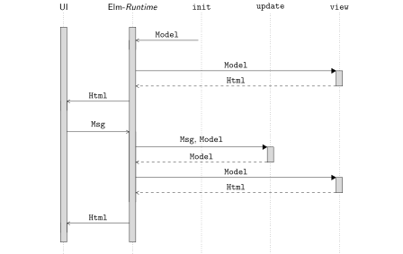

In diesem Kapitel werden wir eine erste Frontend-Anwendung mit Elm
entwickeln.

HTML-Kombinatoren
-----------------

Wir wollen mit einem *Hallo Welt*-Beispiel starten. Zu diesem Zweck
schreiben wir das folgende Programm.

``` elm
module HelloWorld exposing (main)

import Html exposing (Html, text)

main : Html msg
main =
    text "Hallo Welt"
```

Das Modul `Html` stellt Funktionen zur Verfügung, um Html-Seiten zu
erzeugen. Die Bedeutung des Typs `Html msg`, der in der Konstante `main`
verwendet wird, werden wir uns später anschauen. Die Funktion `text` ist
im Modul `Html` definiert und nimmt einen `String` und liefert einen
HTML-Text-Knoten. Unter
<https://package.elm-lang.org/packages/elm/html/latest/> findet sich
eine Beschreibung des Moduls `Html`. Wenn wir eine Definition aus dem
Modul `Html` verwenden wollen, müssen wir es in der Liste hinter
`exposing` aufführen.
Das heißt, statt wie zuvor `exposing (..)` zu nutzen, um alle Definitionen aus einem Modul zu importieren, listen wir hier importierte Definitionen explizit auf.
Im obigen Beispiel importieren wir den Typ `Html` und die Funktion `text` aus dem Modul `Html`.
Bei einem Datentyp kann man angeben, ob man nur den Typ oder auch die Konstruktoren importieren
möchte. Wenn wir so wie oben nur den Namen des Typs angeben, importieren
wir nur den Typ, dürfen die Konstruktoren aber nicht verwenden. Im Fall
von `Html` importieren wir nur den Typ, da wir die Konstruktoren dieses
Typs nie explizit verwenden. Wenn wir auch die Konstruktoren von `Html`
verwenden möchten, müssen wir in der Liste nach `exposing` die Angabe
`Html(..)` machen. Auf diese Weise importieren wir auch die
Konstruktoren.

Die gleichen Angaben, die wir beim Importieren eines
Moduls machen, können wir auch verwenden, um Definitionen aus einem
Modul zu exportieren. Dazu wird die `exposing`-Anweisung genutzt, die
hinter dem Namen des Moduls steht. Hier exportiert das Modul
`HelloWorld` zum Beispiel nur die Funktion `main`.
Das Hauptmodul einer Frontendanwendung muss nur die Funktion `main` expotieren.
Diese Funktion stellt den Einstiegspunkt dar, wenn die Anwendung ausgeführt wird.

Wenn wir ein Modul importieren, können wir eine Definition immer auch
qualifiziert verwenden, das heißt, wir können zum Beispiel `Html.text`
schreiben, um die Funktion `text` aus dem Modul `Html` zu verwenden.
Eigentlich ist es guter Stil, Definitionen qualifiziert zu verwenden, um
explizit anzugeben, wo die Definition herkommt. Im Fall des Moduls
`Html` verzichtet man aber häufig darauf, um Programme übersichtlich zu
halten.
Bei den Funktionen aus dem Modul `Html` ist im Kontext einer Frontend-Anwendung bereits aus dem Namen eindeutig, um welche Funktion es sich handelt.
Daher importiert man in Elm-Anwendungen das Modul `Html` häufig mittels `Html exposing (..)`.

Unter <https://package.elm-lang.org/packages/elm/core/latest/> finden
sich Module, die der Elm-Compiler direkt mitbringt. Diese Module werden
von jedem Elm-Modul implizit wie folgt importiert.

``` elm
import Basics exposing (..)
import List exposing ( List, (::) )
import Maybe exposing ( Maybe(..) )
import Result exposing ( Result(..) )
import String exposing ( String )
import Char exposing ( Char )
import Tuple

import Debug

import Platform exposing ( Program )
import Platform.Cmd as Cmd exposing ( Cmd )
import Platform.Sub as Sub exposing ( Sub )
```

Das heißt zum Beispiel, dass alle Definitionen aus dem Modul `Basics`
direkt zur Verfügung stehen und wir sie unqualifiziert verwenden können.
Im Modul `Basics` sind ganz grundlegende Definitionen aufgeführt, wie der Datentyp `Int` und Operatoren wie `+`.
Aus dem Modul `String` wird nur der Typ `String` importiert. Das heißt,
den Typ `String` können wir unqualifiziert verwenden. Wenn wir
allerdings eine andere Definition aus dem Modul `String` verwenden
möchten, müssen wir diese Definition qualifiziert nutzen. Zum Beispiel
können wir `String.length` schreiben, um die Funktion zu nutzen, die die
Länge einer Zeichenkette liefert. Im Fall von `Maybe` werden durch die
Angabe `Maybe(..)` auch die Konstruktoren importiert. Das heißt, statt
`Maybe.Nothing` zu schreiben, können wir die Konstruktoren
unqualifiziert nutzen und einfach `Nothing` schreiben. Das gleiche gilt
für das Modul `Result`, auch hier werden der Typ `Result` und die
Konstruktoren von `Result` unqualifiziert importiert.

Bei einer Elm-Anwendung ist es guter Stil, Funktionen qualifiziert zu nutzen, also zum Beispiel `String.fromInt` und nicht nur `fromInt`.
Wenn ein Modul einen Datentyp mit identischem Namen zur Verfügung stellt, sollte man den Datentyp (samt Konstruktoren) aber unqualifiziert nutzen.
Das heißt, man sollte nicht `String.String` schreiben, um den Typ `String` zu verwenden, sondern nur `String`.

Um unsere Anwendung zu testen, können wir den Befehl `elm reactor`
verwenden, der einen lokalen Webserver startet. Unter der Adresse
`localhost:8000` erhalten wir eine Auswahl aller Dateien, die sich in
dem entsprechenden Verzeichnis befinden. Wenn wir die Datei auswählen, die unser
`HelloWorld`-Beispiel enthält, erhalten wir die entsprechende
HTML-Seite. Wenn wir die Seite im Browser neu laden, wird der Elm-Code
neu in JavaScript-Code übersetzt und wir erhalten die aktualisierte
Version der Anwendung.

Das Modul `Html` stellt eine ganze Reihe von Funktionen zur Verfügung,
mit deren Hilfe man HTML-Seiten definieren kann. Als weiteres Beispiel
generieren wir einmal eine HTML-Seite mit einem div, das zwei
Text-Knoten als Kinder hat.

``` elm
main : Html msg
main =
    div [] [ text "Hallo Welt", text (String.fromInt 23) ]
```

Die Funktion `div` nimmt zwei Argumente. Das erste Argument ist eine
Liste von Attributen, die das div-Element erhalten soll. Das zweite
Argument ist eine Liste von HTML-Kind-Elementen. Wir könnten in der Liste der
Kind-Elemente also zum Beispiel auch wieder ein div-Element verwenden.

Um die Funktionsweise von Attributen zu illustrieren, geben wir unserem
div-Element einmal einen CSS-Stil. Die Funktion `style` kommt aus dem
Modul `Html.Attributes` und nimmt zwei Strings, nämlich den Namen des
Stils und den entsprechenden Wert, den der Stil haben soll.
Analog zum Modul `Html` importieren wir alle Definitionen aus dem Modul `Html.Attributes` unqualifiziert wie folgt.

```elm
import Html.Attributes exposing (..)
```

Das Module exportiert einen Typ `Attribute` und die Funktion `style`, die wir wie folgt nutzen können.

``` elm
mainContentStyle : List (Attribute msg)
mainContentStyle =
    [ style "background-color" "red", style "height" "90px" ]


main : Html msg
main =
    div mainContentStyle [ text "Hallo Welt", text (String.fromInt 23) ]
```

Statt eine CSS-Datei zu nutzen, kann man in Elm sehr gut _Inline_-Stile verwenden.
Da diese Stile in Elm selbst definiert werden und nicht in einer externen Datei, kann man die Sprachkonstrukte von Elm zur Strukturierung der Stile nutzen.
So sollte man die Stil-Definitionen zum Beispiel in Konstanten auslagern.
Das heißt, statt die Stile direkt als Liste an die HTML-Kombinatoren wie `div` zu übergeben, definiert man eine Konstante wie `mainContentStyle` und gibt ihr einen beschreibenden Namen.
Dadurch hat man ähnlich wie in CSS die Möglichkeit, Kombinationen von Stilen unter einem semantischen Namen zusammenzufassen und wiederzuverwenden.

Als weiteres Beispiel für die Verwendung von Attributen, wollen wir
einen Link definieren.

``` elm
linkStyle : List (Attribute msg)
linkStyle =
    [ style "color" "red" ]


main : Html msg
main =
    a (href "https://hs-flensburg.de" :: linkStyle)
        [ text "Dies ist ein Link" ]
```

In diesem Beispiel kombinieren wir eine Konstante, die den Stil aller
Links definiert mit einem Attribut, das für die Logik der Anwendung
zuständig ist.
Die Funktion `href` nimmt einen `String` und konstruiert das gleichnamige HTML-Attribut.
Der Operator `::` hängt das Element `href "https://hs-flensburg.de"` vorne an die Liste `linkStyle`.
Man sollte die Attribute, die zur visuellen Gestaltung der Elemente gehören von den Attributen trennen, die zur Logik der Web-Anwendung gehören.
Wir könnten ansonsten eine Konstante wie `linkStyle` nicht für alle Links der Web-Anwendung nutzen.

Elm-Architektur
---------------

In diesem Kapitel wollen wir uns über die Architektur einer
Elm-Anwendung unterhalten. Eine Elm-Anwendung besteht immer aus den
folgenden klar getrennten Teilen.

-   **Model**: der Zustand der Anwendung

-   **View**: eine Umwandlung des Zustandes in eine HTML-Seite

-   **Update**: eine Möglichkeit, den Zustand zu aktualisieren

Eine typische Elm-Anwendung hat immer die folgende Struktur.

``` elm
module App exposing (main)

import Browser
import Html exposing (Html)


-- Model

type alias Model = ...


init : Model
init = ...


-- Update

type alias Msg = ...


update : Msg -> Model -> Model
update msg model = ...


-- View

view : Model -> Html Msg
view model = ...


-- Main

main : Program () Model Msg
main =
    Browser.sandbox { init = init, view = view, update = update }
```

Wir haben einen Typ `Model`, der den internen Zustand unserer Anwendung
repräsentiert. Außerdem haben wir einen Typ `Msg`, der Interaktionen mit
der Anwendung modelliert. Diese Typen sind häufig einfach Synonyme für
andere Typen, können aber auch direkt als Aufzählungstyp definiert sein.
Die Konstante `init` gibt an, mit welchem Zustand die Anwendung startet.
Die Funktion `update` nimmt eine Aktion und einen aktuellen Zustand und
liefert einen neuen Zustand. Die Funktion `view` nimmt einen Zustand und
liefert eine HTML-Seite. Außerdem stellt das Modul `Browser` eine
Funktion `sandbox` zur Verfügung, deren Details wir auch erst später
diskutieren werden. An dieser Stelle müssen wir nur wissen, dass wir der
Funktion die Konstante `init` und die Funktionen `update` und `view`,
wie oben angegeben, übergeben müssen. Wir geben hier auch den Typ der
Funktion `main` an, werden ihn aber erst später diskutieren. Im
Unterschied zur *HalloWelt*-Anwendung ist der Typ der Konstante `view`
nun `Html Msg` und nicht mehr `Html msg`. Wir verweisen im `Html`-Typ
also auf den Typ der Nachrichten, die wir an die Anwendung schicken
können.
Was das kleingeschriebene `msg` bedeutet, werden wir im Kapitel [Polymorphismus](polymorphism.md) erfahren.

Wir wollen uns einmal ein sehr einfaches Beispiel für eine Anwendung
ansehen. Wir implementieren einen einfachen Zähler, den Nutzer\*innen hoch- und runterzählen können.

``` elm
module Counter exposing (main)

import Browser
import Html exposing (Html, text)


-- Model

type alias Model =
    Int


init : Model
init =
    0


-- Update

type Msg
    = Increase
    | Decrease


update : Msg -> Model -> Model
update msg model =
    case msg of
        Increase ->
            model + 1

        Decrease ->
            model - 1


-- View

view : Model -> Html Msg
view model =
    text (String.fromInt model)


-- Main

main : Program () Model Msg
main =
    Browser.sandbox { init = init, view = view, update = update }
```

Da wir einen Zähler implementieren wollen, ist unser Zustand vom Typ `Int`.
Initial hat unser Zustand den Wert `0`. Um die Nachrichten darzustellen, die Nutzer\*innen auswählen können, definieren wir einen Aufzählungstyp.
Die Funktion `update` verarbeitet einen Zustand und eine Nachricht und liefert einen neuen Zustand.
Die Funktion `view` liefert zu einem Zustand die HTML-Seite, die den Zustand repräsentiert.

Es ist ein sehr probates Mittel, ein Elm-Modul mithilfe von Kommentaren zu Strukturen.
Wir werden uns später Gedanken darüber machen, wie man eine Elm-Anwendung in mehrere Module zerlegt.
Innerhalb eines Moduls kann man aber sehr gut Kommentare nutzen, um Gruppen von Funktionen zu bilden.
Dieses Konzept ist nicht auf die Elm-Architektur beschränkt, sondern lässt sich ganz allgemein anwenden, um Leser*innen Orientierung in einer Datei zu bieten.

Unserer Anwendung fehlt ein wichtiger Teil, nämlich die Möglichkeit, dass Nutzer\*innen mit der Anwendung interagieren.
Zu diesem Zweck müssen wir nur zwei Knöpfe zu unserer Seite hinzufügen, die die Nachrichten `Increase` und `Decrease` an die Anwendung schicken.

``` elm
view : Model -> Html Msg
view model =
    div []
        [ text (String.fromInt model)
        , button [ onClick Increase ] [ text "+" ]
        , button [ onClick Decrease ] [ text "-" ]
        ]
```

Die Funktion `button` kommt aus dem Modul `Html` und erzeugt einen Knopf
in der HTML-Struktur. Das Modul `Html.Events` stellt die Funktion
`onClick` zur Verfügung. Wir übergeben der Funktion die Nachricht, die
wir bei einem Klick an die Anwendung schicken wollen.
Verwenden Nutzer\*innen diesen Knopf zum Erhöhen des Zählers, wird die Funktion `update` mit der Nachricht `Increase` und dem aktuellen Zustand aufgerufen.
Nach der Aktualisierung wird die Funktion `view` aufgerufen und die entsprechende HTML-Seite angezeigt.

In diesem einfachen Beispiel können wir bereits den deklarativen Ansatz
der Elm-Architektur erkennen. Die Funktion `view` beschreibt, wie ein
Modell als HTML-Struktur dargestellt wird. Das heißt, wir beschreiben
nur, was dargestellt werden soll, aber nicht wie die konkrete
Darstellung durchgeführt wird. Im Kontrast dazu, würde eine sehr
klassische JavaScript-Anwendung beschreiben, wie die HTML-Struktur
geändert wird. Der entsprechende HTML-Knoten wird aus der HTML-Struktur
herausgesucht und der Zähler durch den veränderten Wert ersetzt.

Die Abbildung <a href="#sequence-diagram">Kommunikation einer Elm-Anwendung</a> illustriert noch einmal, wie die Komponenten der Elm-Architektur miteinander iteragieren, wenn eine Anwendung mittels `Browser.sandbox` gestartet wurde.

<figure id="sequence-diagram">
  
  <figcaption>Kommunikation einer Elm-Anwendung</figcaption>
</figure>

Debugging
---------

Zum Abschluss dieses Kapitels soll noch kurz eine Möglichkeit
vorgestellt werden, mit der man in Elm einfaches *Print Debugging*
machen kann. Das Modul `Debug` stellt eine Funktion
`log : String -> a -> a` zur Verfügung. Wenn diese Funktion ausgewertet
wird, schreibt sie ihr zweites Argument auf die Konsole. Der `String` im
ersten Argument wird dieser Ausgabe vorangestellt. Wir nutzen in unserer
einfachen Zähleranwendung zum Beispiel die folgende Definition von
`update`.

``` elm
update : Msg -> Model -> Model
update msg model =
    case msg of
        Increase ->
            Debug.log "Modell" (model + 1)

        Decrease ->
            model - 1
```

Wir führen die Anwendung nun aus und schauen uns die Entwickler-Konsole
unseres Browsers an. Wenn wir wiederholt auf den Knopf für das Erhöhen
des Zählers drücken, erhalten wir die folgende Ausgabe.

    Modell: 1
    Modell: 2
    Modell: 3

Da wir an `Debug.log` den Wert `model + 1` übergeben, wird in der
Konsole jeweils der Wert angezeigt, den der Zähler nach der Erhöhung
hat. Wenn wir auf den Knopf für das Verringern des Zählers drücken,
erhalten wir keine Ausgabe, da der Aufruf von `Debug.log` nur ausgeführt
wird, wenn die Nachricht `Increase` lautet.

<div class="nav">
    <ul class="nav-row">
        <li class="nav-item nav-left"><a href="basics.html">zurück</a></li>
        <li class="nav-item nav-center"><a href="index.html">Inhaltsverzeichnis</a></li>
        <li class="nav-item nav-right"><a href="style.html">weiter</a></li>
    </ul>
</div>