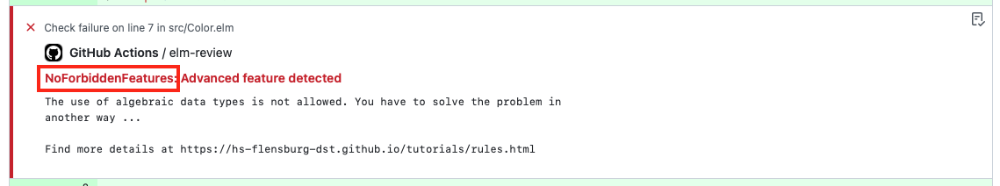

Wenn Sie die Laboraufgabe bearbeiten, erhalten Sie automatisiert Feedback zum Programmierstil.
Auf dieser Seite werden einige der Programmierregeln erläutert, die durch den Linter angemerkt werden.


1. [Name einer Regel](#name-einer-regel)

2. [Regeln](#regeln)

    1. [NoForbiddenFeatures](#noforbiddenfeatures)

    2. [RemoveCodeDuplication](#removecodeduplication)

<br/>

## Name einer Regel

Die Stil-Anmerkungen des Linters beinhalten neben der kurzen Beschreibung auch Informationen darüber, in welcher Datei der Verstoß gefunden wurde, und vor allem, gegen welche Regel verstoßen wurde.
Im Folgenden Bild ist zu sehen, wo man den Namen der Regel findet.
 


## Regeln

Bei Programmierregeln gibt es keine Kategorien wie richtig und falsch.
Man kann auch gute Programme schreiben, die sich nicht an die folgenden Regeln halten.
Außerdem hängt die Lesbarkeit von Programmen auch sehr von der Erfahrung der Lesenden ab.
Viele dieser Regeln sorgen aber dafür, dass die Programme eine einfachere Struktur erhalten.
Am Ende sollen die Regeln auch dafür sorgen, dass Sie sich bewusst werden, dass es verschiedene Möglichkeiten gibt, ein Programm zu schreiben und man beim Programmieren reflektieren sollte, welche der Möglichkeiten am besten geeignet ist, um ein gut lesbares und wartbares Programm zu schreiben.
Grundsätzlich sollte man immer Konsistenz anstreben.
Das heißt, wenn es zweimal eine ähnliche Funktion gibt, sollten diese auch ähnlich implementiert sein.
Wenn man dagegen bei einer der Funktion eine andere Implementierung wählt, erwarten Lesende, dass dieser Unterschied einen inhaltlichen Grund hat.


### NoForbiddenFeatures

Zur Lösung der Laboraufgaben sollen nur die Sprach-Features von Elm verwendet werden, die in der Vorlesung schon vorgestellt wurden.
Die Laboraufgaben sollen häufig den Umgang mit bestimmten Features der Sprache trainieren.
Dafür ist es aber wichtig, dass diese Features der Sprache auch tatsächlich zur Lösung der Aufgabe verwendet werden.
Dabei gilt immer der Umfang der Sprache, der vor der Ausgabe der Aufgabe bekannt war.

Sprach-Features wie algebraische Datentypen, Polymorphismus, Funktionen höherer Ordnung und lokale Definitionen sollen erst verwendet werden, wenn diese auch in der Vorlesung behandelt wurden.

Die Funktion `List.append` sollte nicht verwendet werden, da stattdessen der Operator `++` verwendet werden sollte.

Die Funktion `List.map` soll erst verwendet werden, wenn diese in der Vorlesung behandelt wurde.


### RemoveCodeDuplication

Man sollte sich beim Programmieren bemühen, Code-Duplikation zu vermeiden.
Code-Duplikation bedeutet, dass ein Programm mehrere identische oder nahezu identische Abschnitte enthält.
Diese Regel identifiziert eine spezielle Form von Code-Duplikation.

Wir betrachten das folgende Code-Beispiel.

```elm
heatMapSquare : Int -> Svg Msg
heatMapSquare value =
    if value < 50 then
        drawSquare 100 Yellow

    else
        drawSquare 100 Red
```

Wir nehmen an, dass wir eine _Heat Map_ aus Quadraten zeichnen.
Die Farbe der Quadrate hängt von einem Zahlenwert ab.
Ab dem Wert `50` soll das Quadrat rot gezeichnet werden, ansonsten gelb.

Die Regel `RemoveCodeDuplication` würde bei dieser Funktion eine Code-Duplikation erkennen.
In beiden Fällen des `if`-Ausdrucks wird die Funktion `drawSquare` aufgerufen und in beiden Fällen wird als Seitengröße `100` übergeben.
Die Aufrufe unterscheiden sich nur darin, welche Farbe die Quadrate erhalten.
Daher kann die Definition wie folgt umgeformt werden.

```elm
heatMapSquare : Int -> Svg Msg
heatMapSquare value =
    drawSquare 100
        (if value < 50 then
            Yellow

         else
            Red
        )
```

Das heißt, wir können den Aufruf der Funktion `drawSquare` aus den Zweigen des `if`-Ausdrucks herausziehen.
Bei diesem Code ist viel klarer, in welcher Hinsicht sich die beiden Fälle unterscheiden, nämlich nur in Bezug auf die Farbe.

Die Anwendung dieser Regel führt nicht immer zu besser lesbarem Code.
Die Regel führt aber dazu, dass Invarianten, die im Code vorhanden sind, besser herausgearbeitet werden.
In diesem Beispiel hängt etwa nur die Farbe des Quadrates vom Zahlenwert ab, aber nicht die Form der Graphik.
Um diese Invariante expliziter im Code auszudrücken, kann es sinnvoll sein, nach dem Herausziehen eine zusätzliche Funktion zu definieren.
Wir können unser Beispiel etwa wie folgt definieren.

```elm
heatMapSquare : Int -> Svg Msg
heatMapSquare value =
    drawSquare 100 (heatMapColor value)


heatMapColor : Int -> Color
heatMapColor value =
    if value < 50 then
        Yellow

    else
        Red
```

In dieser Implementierung ist sofort ersichtlich, dass nur die Farbe des Quadrates vom Zahlenwert abhängt, die Form der Graphik sich aber nie ändert.
